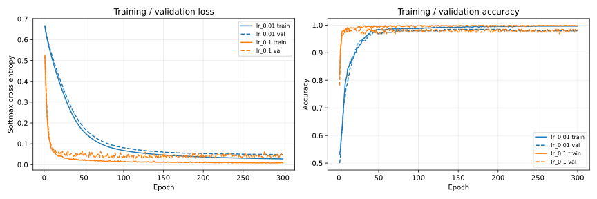
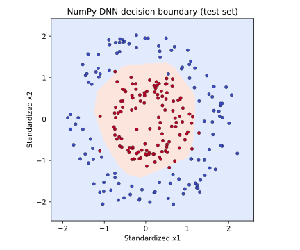

# NumPy로 직접 구현한 DNN Forward / Backward Propagation

| 항목 | 작성 내용 |
|---|---|
| 제출자 | 이름을 입력하세요 |
| 학번 | 학번을 입력하세요 |
| 과목 | 딥러닝 + 머신러닝 |
| 평가 주제 | Dense 기반 DNN의 순전파·역전파 직접 구현 |

## 1. 프로젝트 개요

첨부된 `Optimization.ipynb`의 **파라미터 초기화 → 미니배치 생성 → forward → loss → backward → 파라미터 업데이트** 흐름을 활용한 실습 프로젝트이다. NumPy로 생성한 두 동심원 데이터를 분류하며, 은닉층 2개와 출력층 1개를 갖는 DNN을 구현하였다.

Dense, ReLU, Tanh, Softmax Cross Entropy의 순전파와 미분을 직접 작성하였다. PyTorch, TensorFlow, 자동미분, scikit-learn 데이터 생성·분할 함수를 사용하지 않는다. NumPy는 배열 연산, Matplotlib은 결과 시각화에 사용한다. 이 README에 구현 설명, 실험 결과, gradient checking 결과를 함께 기록하였다.

## 2. 실행 방법

### Google Colab

1. Google Colab에서 **파일 → 노트북 업로드**를 선택한다.
2. `Optimization_DNN.ipynb` 하나를 업로드한다.
3. 런타임은 **Python 3 / CPU**로 설정한다. GPU는 필요하지 않다.
4. **런타임 → 모두 실행**을 선택한다.
5. shape 확인, gradient checking, 학습 로그, 학습 곡선, 최종 테스트 성능을 순서대로 확인한다.

노트북 안에 구현 코드가 모두 포함되어 있으므로 `src/` 파일이나 원본 첨부 자료를 추가로 업로드할 필요가 없다. `data.mat`, `public_tests.py`, `testCases.py`, `test_utils.py`도 실행에 필요하지 않다. Colab의 기본 NumPy·Matplotlib 환경을 사용한다. 제출된 노트북의 결과는 전체 셀을 실제로 실행하여 생성하였다.

### 로컬 Python

압축을 푼 뒤 `DNN_Submission/` 폴더에서 실행한다.

```bash
pip install -r requirements.txt
python src/train.py
```

학습이 끝나면 `results/`의 CSV, JSON, PNG 파일이 갱신된다. 구현 검증은 다음 명령으로 실행한다.

```bash
python src/verify.py
```

독립 검증 **9개 항목 모두 통과**하였다. Dense·ReLU·Tanh·손실의 수치미분, 큰 logits에서의 안정성, 배치 평균의 한 번 적용, gradient 검사 후 값 복원, 데이터 분할·표준화, 미니배치의 나머지·샘플 대응, 실제 학습의 loss 감소를 확인하였다. 실행 결과는 [module_verification.json](results/module_verification.json)에 저장된다. 원본 첨부의 `update_parameters_with_gd_test`까지 추가 적용한 사전 검증도 **10개 항목 모두 통과**하였으며 [verification.json](results/verification.json)에 기록하였다. 이 추가 기록을 재현하기 위한 원본 테스트 파일은 Colab 실행에 필요하지 않다.

### 폴더 구성

```text
DNN_Submission/
├── Optimization_DNN.ipynb       # Colab에서 단독 실행 가능한 노트북
├── README.md                   # 구현 설명 + 실험 보고서
├── requirements.txt            # NumPy, Matplotlib
├── src/
│   ├── opt_utils.py            # 데이터, 레이어, 모델, 학습, 검사, 시각화
│   ├── train.py                # 로컬 학습·결과 저장 진입점
│   └── verify.py               # 구현 검증 진입점
└── results/
    ├── experiment_summary.json # 실험 설정·최종 지표
    ├── gradient_check.json     # 수치미분 검사 결과
    ├── module_verification.json # 독립 구현 검증 9/9
    ├── verification.json       # 원본 SGD 테스트 포함 검증 10/10
    ├── notebook_execution.json # 노트북 14개 코드 셀 전체 실행 증거
    ├── lr_0.01_history.csv      # 300 epoch 전체 로그
    ├── lr_0.1_history.csv
    ├── learning_curves.svg      # GitHub에서도 표시되는 그래프
    └── decision_boundary.svg
```

## 3. 원본 실습을 활용한 부분과 변경한 부분

| 원본 실습의 요소 | 이번 제출물에서의 활용 |
|---|---|
| `update_parameters_with_gd()` | `W -= learning_rate * dW`, `b -= learning_rate * db`와 파라미터·gradient 딕셔너리 구조를 유지한다. `DeepNeuralNetwork.step()`에서 실제로 호출한다. |
| `random_mini_batches()` | 함수 이름을 유지하고 새 `get_batches()`를 호출하는 래퍼로 구현한다. 셔플 후 같은 인덱스로 입력과 정답을 나누며 마지막 작은 배치도 포함한다. |
| `initialize_parameters(layers_dims)` | `layers_dims=(2, 16, 8, 2)` 설정 방식을 유지한다. 반환값은 각 레이어를 가진 모델 객체로 변경한다. |
| `forward_propagation()`, `backward_propagation()` | 함수 이름을 유지하고 모델의 `forward()`와 `backward()`를 호출한다. 캐시는 각 레이어 내부에 저장한다. |
| `compute_cost()`, `predict()`, `load_dataset()` | 실습에서 사용한 이름을 유지한다. 이번 데이터·손실함수·배치 방향에 맞게 내부를 구현한다. |
| `model()` | epoch 반복문 안에서 미니배치마다 forward → cost → backward → update를 수행하는 순서를 유지한다. validation 지표 기록을 추가한다. |

평가 조건에 맞추기 위해 다음을 변경하였다.

- 원본의 `(features, batch)` 입력을 **`(batch, features)`**로 변경하였다. 정답은 정수 클래스 배열 `(batch,)`이다.
- 원본의 moons 데이터 로딩을 **NumPy circles 직접 생성**으로 대체하였다.
- 함수 내부의 레이어 계산을 `DenseLayer`, `ReLU`, `Tanh`, `SoftmaxCrossEntropy` 객체로 구성하여 각 계산과 캐시를 확인할 수 있게 하였다.
- 출력층을 2차원 logits으로 만들고 **Softmax Cross Entropy**를 사용하였다.
- SGD를 구현하고, 선택 사항인 Momentum·Adam·학습률 스케줄은 이번 실험에 포함하지 않았다.
- train/validation/test 분리, train 통계만 사용하는 표준화, gradient checking, epoch별 CSV 로그를 추가하였다.

원본 `public_tests.py` 등의 미니배치 검사는 `(features, batch)` 입력과 `(1, batch)` 정답을 전제로 한다. 이번 `get_batches()`는 `(batch, features)`와 `(batch,)`를 사용하고 반환 방식도 iterator이므로 그 검사를 그대로 적용할 수 없다. 이번 구현은 새 인터페이스의 shape 검사와 수치미분 검사로 검증한다. 원본 자료의 미완성 optimizer 연습 문제를 그대로 제출하는 구조는 아니다.

## 4. 데이터 파이프라인

`load_data(n_samples=1200, noise=0.12, seed=3)`가 두 동심원 클래스를 생성한다. 각 클래스는 600개이며 클래스 0의 반지름은 1.0, 클래스 1은 0.45이다. 각도는 `[0, 2π)`에서 균등하게 뽑고, 두 좌표에 표준편차 0.12의 가우시안 잡음을 더한다.

`split_data()`는 클래스 비율을 유지하면서 먼저 train pool과 test를 **8:2**로 나눈다. 그 다음 train pool의 20%를 validation으로 분리한다. 최종 크기는 다음과 같다.

| 구분 | 샘플 수 | 전체 비율 | 사용 목적 |
|---|---:|---:|---|
| Train | 768 | 64% | gradient 계산·파라미터 업데이트 |
| Validation | 192 | 16% | 학습률 선택 |
| Test | 240 | 20% | 선택 완료 후 최종 성능 평가 |

`standardize()`는 **train의 평균과 표준편차만** 계산한다. 같은 통계로 validation과 test를 변환하여 정보 유출을 방지한다.

```text
X_scaled = (X - train_mean) / train_std
train_mean = [-0.0169484762, -0.0000649634]
train_std  = [ 0.5782081112,  0.5456449853]
```

`get_batches(X, y, batch_size, shuffle=True)`는 매 epoch 샘플 순서를 섞고 크기 32의 배치를 만든다. 입력과 정답에는 동일한 인덱스를 적용한다. 마지막 나머지 배치도 반환하지만, 이번 train 크기 768에서는 32개씩 24개 배치가 만들어진다.

## 5. 모델 구조와 초기화

```text
입력 (B, 2)
  → Dense(2, 16) → ReLU
  → Dense(16, 8) → Tanh
  → Dense(8, 2)
  → Softmax Cross Entropy
```

여기서 `B`는 배치 크기이다. **Dense 레이어는 3개, 은닉층은 2개**이며, ReLU와 Tanh 모듈을 모두 실제 학습 경로에서 사용한다. 마지막 Dense는 추가 활성함수 없이 logits을 반환하고 손실 모듈 내부에서 Softmax를 계산한다.

| 레이어 | W shape | b shape | 출력 shape | 초기화 | 파라미터 수 |
|---|---|---|---|---|---:|
| Dense 1 | `(2, 16)` | `(1, 16)` | `(B, 16)` | He | 48 |
| Dense 2 | `(16, 8)` | `(1, 8)` | `(B, 8)` | Xavier | 136 |
| Dense 3 | `(8, 2)` | `(1, 2)` | `(B, 2)` | Xavier | 18 |
| 합계 | | | | | **202** |

He 가중치는 `N(0, 1) * sqrt(2 / fan_in)`, Xavier 가중치는 `N(0, 1) * sqrt(1 / fan_in)`으로 생성한다. ReLU와 연결된 첫 번째 Dense에는 He, Tanh와 연결된 두 번째 Dense 및 출력 Dense에는 Xavier를 사용한다. bias는 모두 0으로 초기화한다.

ReLU는 양수 영역에서 gradient를 전달하고 계산이 간단하다. Tanh는 출력 범위가 `[-1, 1]`이고 미분식을 직접 구현하기 쉬워 두 번째 은닉층에 사용하였다. 두 활성함수는 동심원을 구분하는 비선형 경계를 학습할 수 있게 한다. 클래스가 2개지만 출력 logits 두 개와 정수 label을 사용하므로 Softmax Cross Entropy를 선택하였다.

## 6. 순전파와 역전파 직접 구현

### Dense

입력 `X: (B, F_in)`, 가중치 `W: (F_in, F_out)`, bias `b: (1, F_out)`에 대해 계산한다.

```text
forward:  out = X @ W + b
backward: dW  = X.T @ dout
          db  = sum(dout, axis=0, keepdims=True)
          dX  = dout @ W.T
```

`DenseLayer`는 `W`, `b`, `dW`, `db`를 보관하고, 순전파의 `X`와 출력 shape를 `cache`에 저장한다. `dout`은 순전파 출력과 같은 shape여야 하며, `dW`, `db`, `dX`가 각각 `W`, `b`, `X`와 같은 shape인지 검사한다. bias는 모든 샘플에 더해지므로 backward에서는 배치 방향으로 합산한다.

### 활성함수

```text
ReLU forward:  out = max(0, X)
ReLU backward: dX = dout * (X > 0)

Tanh forward:  out = tanh(X)
Tanh backward: dX = dout * (1 - out**2)
```

ReLU는 순전파 입력을, Tanh는 순전파 출력을 캐싱한다. 둘 다 입력·출력·gradient shape가 동일하다. ReLU의 0에서의 미분은 0으로 정의한다.

### Softmax Cross Entropy

각 샘플의 logits에서 최댓값을 빼고 log-sum-exp 형태로 계산하여 큰 logits에서의 수치 불안정을 줄인다.

```text
shifted   = logits - max(logits, axis=1, keepdims=True)
log_probs = shifted - log(sum(exp(shifted), axis=1, keepdims=True))
probs     = exp(log_probs)
loss      = -mean(log_probs[각 샘플 인덱스, 정답 클래스])
dlogits   = (probs - one_hot(y)) / B
```

실제 backward 코드는 one-hot 전체 배열을 만드는 대신 정답 클래스 위치에서 1을 뺀다. 확률과 정답을 캐싱하고 `(B, 2)`의 `dlogits`를 반환한다.

**배치 평균은 손실의 backward에서 한 번만 적용한다.** Dense의 `dW`와 `db`를 다시 `B`로 나누면 gradient가 지나치게 작아지므로 추가 평균을 하지 않는다.

### 모델 컨테이너와 SGD

`DeepNeuralNetwork`는 레이어 리스트를 보관한다. `forward(X)`는 리스트 순서대로, `backward(dout)`는 역순으로 각 레이어를 호출한다. `step(learning_rate)`는 각 Dense의 파라미터와 gradient를 딕셔너리에 모아 원본 실습 방식의 `update_parameters_with_gd()`를 호출한다.

```text
W_new = W - learning_rate * dW
b_new = b - learning_rate * db
```

이번 학습은 이 SGD 업데이트를 미니배치에 적용하는 **mini-batch SGD**이다. 각 배치에서 forward와 backward를 마친 직후 업데이트하며, validation/test 데이터로는 gradient를 계산하지 않는다.

## 7. Gradient checking

학습 전 모델과 train 샘플 5개를 사용하였다. 모든 Dense의 `W`, `b` **202개 값 전체**와 입력 `X`의 **10개 값**을 검사하였다. 따라서 `dW`, `db`뿐 아니라 입력으로 전달되는 `dX`도 검사한다.

중앙차분 수치미분과 직접 계산한 gradient를 비교한다.

```text
numeric_gradient = [J(theta + epsilon) - J(theta - epsilon)] / (2 * epsilon)
relative_error   = ||analytic - numeric||₂ / (||analytic||₂ + ||numeric||₂ + 1e-12)
epsilon          = 1e-5
통과 기준         = 각 검사 항목의 relative_error < 1e-6
```

각 값을 조금씩 바꿀 때마다 전체 forward와 loss를 다시 계산하며, 검사 후 파라미터·입력 값과 캐시·gradient를 복원한다. ReLU의 미분 불가능 지점인 0 근방을 피하기 위해 검사 배치의 ReLU 입력도 확인한다. 이번 최소 절댓값은 `0.0010169582`로 검사 조건인 `100 * epsilon = 0.001`보다 크다.

| 검사 항목 | Shape | 검사 값 수 | 상대 오차 | 최대 절대 오차 | 결과 |
|---|---|---:|---:|---:|---|
| W1 | `(2, 16)` | 32 | `8.168498e-11` | `1.194633e-11` | 통과 |
| b1 | `(1, 16)` | 16 | `6.255803e-11` | `1.587930e-11` | 통과 |
| W2 | `(16, 8)` | 128 | `1.290690e-10` | `2.016695e-10` | 통과 |
| b2 | `(1, 8)` | 8 | `3.504799e-11` | `1.118364e-11` | 통과 |
| W3 | `(8, 2)` | 16 | `1.579987e-11` | `7.398082e-12` | 통과 |
| b3 | `(1, 2)` | 2 | `5.668047e-11` | `1.148573e-11` | 통과 |
| X → dX | `(5, 2)` | 10 | `1.148849e-10` | `1.267906e-11` | 통과 |

가장 큰 상대 오차도 약 `1.29e-10`으로 기준 `1e-6`보다 작다. 모든 검사 항목이 통과하여 이 검사 지점에서 직접 구현한 역전파가 수치미분과 일치함을 확인하였다. 원시 결과는 [gradient_check.json](results/gradient_check.json)에 저장하였다.

## 8. 학습 설정과 실험 방법

| 설정 | 값 |
|---|---|
| 데이터 | NumPy circles 1,200개, noise 0.12 |
| 모델 | `2 → 16 → 8 → 2` |
| 활성함수 | 첫 은닉층 ReLU, 두 번째 은닉층 Tanh |
| 손실함수 | Softmax Cross Entropy |
| Optimizer | Mini-batch SGD |
| 배치 크기 | 32 |
| Epoch | 300 |
| 비교 학습률 | 0.01, 0.1 |
| 데이터·모델 seed | 3 |
| 첫 분할 / validation 분할 seed | 10 / 11 |
| 배치 셔플 seed | 10 |
| 학습률 선택 기준 | 300 epoch 종료 시 validation loss가 작은 실험 |

두 학습률 실험은 같은 데이터, 같은 초기 가중치, 같은 배치 순서를 사용한다. 학습률만 변경하여 비교하였다. 매 epoch 종료 시점의 파라미터로 전체 train과 validation의 loss·accuracy를 기록하였다. CSV의 `batch_loss`는 epoch 안에서 업데이트가 진행되는 동안의 배치 loss를 샘플 수로 가중평균한 값이며, 그래프와 아래 표의 `train_loss`는 epoch 종료 후 다시 평가한 값이다.

300 epoch 마지막 validation loss를 기준으로 모델을 선택한 다음 **선택된 모델의 test 성능을 한 번 평가**하였다. Test 결과로 학습률을 선택하지 않았다. Early stopping이나 최적 epoch 선택은 적용하지 않았다.

## 9. 실험 결과

학습 전 공통 train loss는 **0.712891**이었다. 다음 수치는 저장된 실제 실행 로그를 반올림한 값이다.

| 학습률 | Epoch | Train loss | Train accuracy | Validation loss | Validation accuracy |
|---:|---:|---:|---:|---:|---:|
| 0.01 | 1 | 0.666837 | 53.26% | 0.668565 | 50.00% |
| 0.01 | 50 | 0.158141 | 98.44% | 0.177607 | 96.88% |
| 0.01 | 100 | 0.067616 | 98.70% | 0.081211 | 97.92% |
| 0.01 | 300 | 0.027470 | 99.61% | 0.047796 | 97.92% |
| 0.1 | 1 | 0.517885 | 81.90% | 0.527927 | 78.12% |
| 0.1 | 50 | 0.019931 | 99.48% | 0.044028 | 97.40% |
| 0.1 | 100 | 0.013051 | 99.74% | 0.045616 | 97.40% |
| 0.1 | 300 | 0.007302 | 99.87% | 0.047773 | 97.92% |

최종 validation loss는 학습률 0.01에서 `0.0477960889`, 학습률 0.1에서 `0.0477733136`이었다. 정한 선택 규칙에 따라 **학습률 0.1** 모델을 선택하였다.

| 최종 선택 모델 | Loss | Accuracy | 맞힌 샘플 / 전체 |
|---|---:|---:|---:|
| Train | 0.007302 | 99.87% | 767 / 768 |
| Validation | 0.047773 | 97.92% | 188 / 192 |
| Test | **0.095187** | **97.50%** | **234 / 240** |

학습률 0.1은 50 epoch에서 train loss가 약 0.0199로, 학습률 0.01의 약 0.1581보다 빠르게 감소하였다. 다만 두 실험의 최종 validation loss 차이는 약 `0.0000228`이고 validation accuracy는 같다. 따라서 이번 결과는 큰 학습률의 수렴 속도가 좋았음을 보여주지만, 일반화 성능이 크게 더 좋다고 해석하지 않는다.

선택된 모델의 train accuracy와 test accuracy에는 약 2.37%p 차이가 있다. Train loss가 계속 감소하는 동안 validation loss는 50 epoch 이후 일부 증가하였다. 이는 학습 데이터에 더 맞춰지는 경향을 보여주며, 후속 실험에서는 early stopping이나 정규화를 비교할 수 있다. 이번 성능은 잡음이 있는 toy 데이터와 단일 seed의 결과이므로 실제 데이터나 다른 seed에서의 성능을 보장하지 않는다.

### 학습 곡선



### 선택된 모델의 결정 경계

아래 점은 test 샘플이고 배경 색은 모델의 예측 클래스이다. 좌표는 train 통계로 표준화된 값이다.



전체 로그와 설정은 [lr_0.01_history.csv](results/lr_0.01_history.csv), [lr_0.1_history.csv](results/lr_0.1_history.csv), [experiment_summary.json](results/experiment_summary.json)에서 확인할 수 있다.

## 10. 평가 조건 확인

| 평가 조건 | 구현 위치·결과 |
|---|---|
| Dense 3개 이상, 은닉층 2개 이상 | `initialize_parameters()`: Dense 3개, 은닉층 2개 |
| He 또는 Xavier 초기화 | 첫 Dense He, 나머지 Xavier, bias 0 |
| Forward 캐시·배치 shape 검증 | 각 레이어 `forward()`·`backward()`의 cache와 assert |
| Dense의 dW, db, dX 직접 구현 | `DenseLayer.backward()` |
| ReLU 필수 + Tanh 또는 Sigmoid | `ReLU`, `Tanh` 모두 모델에 포함 |
| Softmax Cross Entropy 직접 구현 | `SoftmaxCrossEntropy.forward()`·`backward()` |
| 수치미분 gradient checking | 파라미터 202개 + 입력 10개, 전 항목 통과 |
| 데이터 직접 생성·분할·정규화 | `load_data()`, `split_data()`, `standardize()` |
| 설정 가능한 mini-batch iterator | `get_batches(X, y, batch_size, shuffle=True)` |
| 레이어 리스트 모델 컨테이너 | `DeepNeuralNetwork.forward()`·`backward()`·`step()` |
| SGD·epoch별 지표·최종 성능 | `model()`, `run_experiments()`, CSV·JSON |
| 실험 및 보고서 | 학습률 2개 비교, 본 README와 그래프 |
| Colab ipynb·소스 폴더·README | 노트북 단독 실행 및 `src/`, 본 파일 제공 |

## 11. 시연용 질문과 답변

1. **왜 은닉층이 필요한가?** 두 동심원은 직선 하나로 구분하기 어렵다. Dense와 비선형 활성함수를 조합하여 원형에 가까운 결정 경계를 학습한다.
2. **Backward에서 cache는 왜 필요한가?** Dense의 dW 계산에는 순전파 입력 X가 필요하고, ReLU·Tanh의 미분에는 순전파 입력 또는 출력이 필요하다.
3. **왜 Dense에서 gradient를 배치 크기로 다시 나누지 않는가?** 손실 backward의 `(probs - one_hot(y)) / B`에 평균이 이미 포함되어 있기 때문이다.
4. **Gradient checking은 무엇을 확인하는가?** 직접 유도한 역전파 gradient를 손실의 중앙차분 수치미분과 비교한다. 이번 최대 상대 오차는 약 `1.29e-10`이다.
5. **왜 test가 아니라 validation으로 학습률을 선택하는가?** Test는 선택 과정에 사용하지 않고 최종 모델의 성능을 평가하는 데 남겨두어야 하기 때문이다. 이번 선택 모델의 test accuracy는 97.50%이다.


## GitHub에서 다운로드

저장소의 **Code → Download ZIP**을 눌러 전체 파일을 내려받는다. 압축을 풀면 `DNN_Submission/Optimization_DNN.ipynb`와 소스·보고서·결과를 확인할 수 있다. 개별 노트북 페이지에서는 **Download raw file**로 ipynb만 받을 수도 있다. 저장소에는 SVG 그래프를 포함했으며, 노트북과 `train.py`를 실행하면 PNG 그래프도 생성된다.
